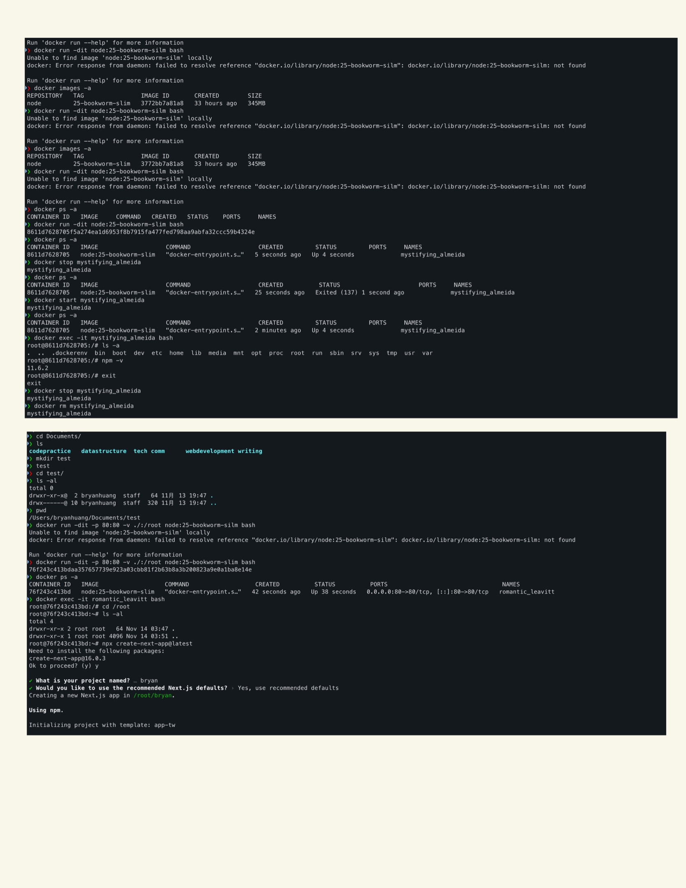
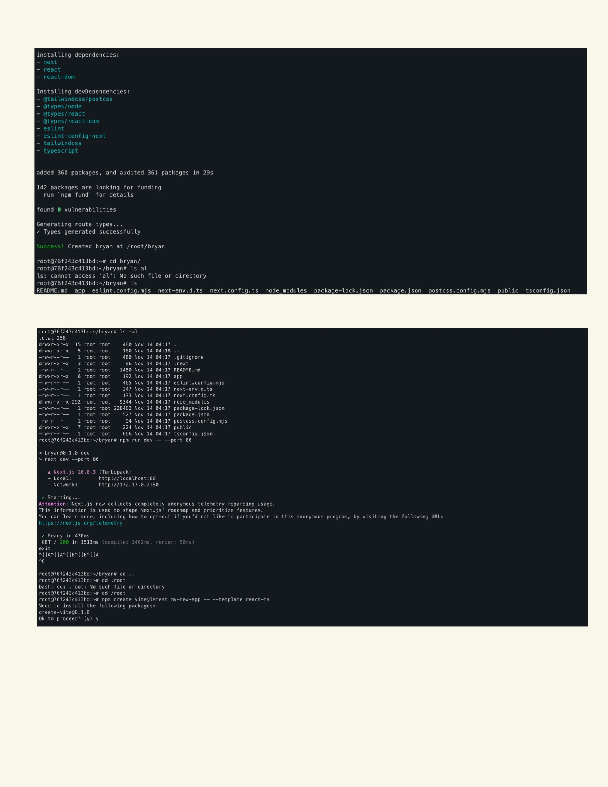

# Meeting Record 2025-11-13

# Topics
- What is Docker?
    - Docker is a platform that can package code and runtime environment into containers that can run consistently on any machine.

- Core Concepts
    - Image: A "Module" of the implement environment.
    - Container: A running sample create by Image.
    - Dockerfile: Descibe how image is build.

- Common Docker Commands
    ```bash
    docker images                                          # List images
    docker pull <image>                                    # Download image from Docker Hub
    docker rmi <image>                                     # Remove image
    docker ps                                              # List running containers
    docker ps -a                                           # List all containers
    docker run -dit <image> bash                           # Run a container
    docker start <id>                                      # Start container
    docker stop <id>                                       # Stop container
    docker rm <id>                                         # Remove container

    docker run -dit -p 80:80 -v ./:/root <image> bash      # Run the container in the background with an interactive shell, map host port 80 to container port 80, and mount the current directory to /root inside the container      
    ```





